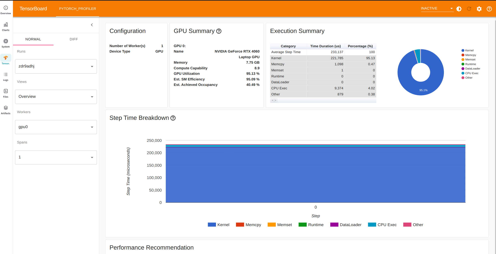
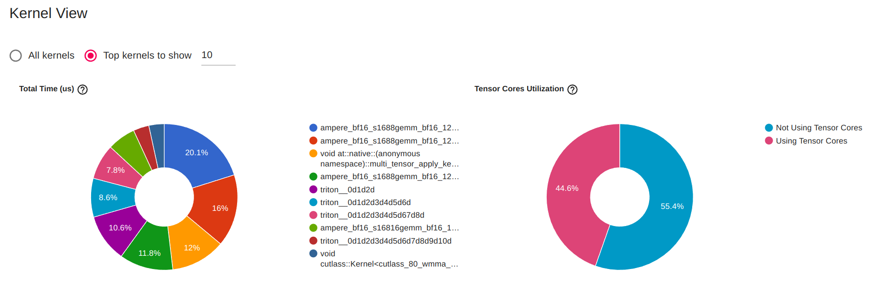
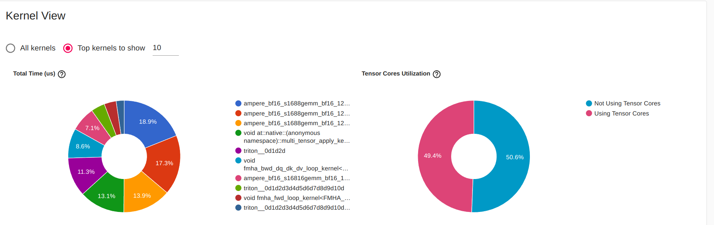
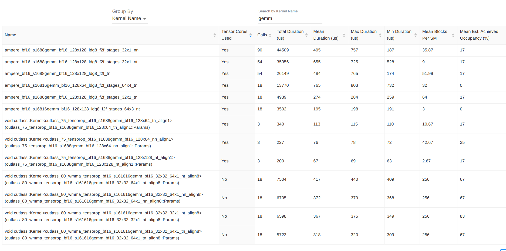
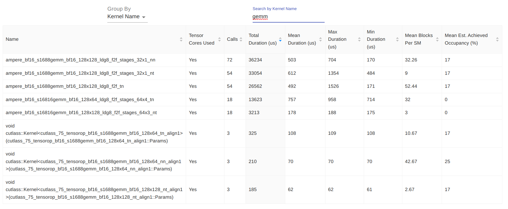

# Profiling the training of [nanoGPT](https://github.com/karpathy/nanoGPT) with different implementations of the attention layer

This project is based on nanoGPT -- a medium-sized GPT model that is able to reproduce GPT-2 on OpenWebText. Please refer to the [original repository](https://github.com/karpathy/nanoGPT) for details. This project will focus on the computational efficiency of the Attention Layers used by the model.

PyTorch >= 2.0 introduces an optimization of the Attention Layer referred to as *Flash Attention*. The key idea introduced by the [Flash Attention](https://arxiv.org/abs/2205.14135) paper is to minimize memory movement during computation, i.e. reads and writes on different levels of the memory hierarchy, which makes computations and therefore training much faster.

In these experiments I will focus on a tiny version of the model trained on the works of Shakespeare. I don't aim for optimizing training at this point.


#### What is different?

I have used Karpathy's nanoGPT as a starting point, and have made the following changes and contributions on top of it:
 - refactored ``config/train_shakespear_char.py`` to contain all tunable parameters.
 - introduced ``train_torch_profiler.py`` and ``train_nsight_profiler.py``, which are adaptations of 
 the original ``train.py`` for profiling with different tools.
 - introduced ``benchmark.ipynb`` with experiments benchmarking the two types of attention.
 - introduced ``cuda/gemm_kernel.cu`` for profiling experiments with the GEMM kernel using [CUTLASS](https://github.com/NVIDIA/cutlass/tree/main).
 
 ---
</br>


## Training parameters:

<sub>
  
- gradient_accumulation_steps = 1
  
- batch_size = 64
  
- block_size = 256 (context of up to 256 previous characters)
  
- n_layer = 6
  
- n_head = 6
  
- n_embd = 384
  
- dropout = 0.2
  
- flash = True
  
- learning_rate = 1e-3
  
- max_iters = 6000
  
- lr_decay_iters = max_iters
  
- min_lr = 1e-4
  
- beta2 = 0.99
 </sub>
 
</br>

# Training faster with Flash attention.

We train the model for a few hundred iterations with both "slow" and "flash" attention. Results can be visualized [here](https://wandb.ai/m-motta/profile-attention-nano-gpt/reports/GPU-Profiling-slow-vs-flash-attention--Vmlldzo1NjA0MzI1). Training and validation metrics don't differ for both types of attention, but the GPU utilization does. In particular, we see that flash attention trains much faster (less than half of the time in this short probing experiment).

 Wandb uses [nvidia-ml-py3](https://github.com/nicolargo/nvidia-ml-py3/blob/master/pynvml.py) to collect[ system metrics](https://docs.wandb.ai/guides/app/features/system-metrics). 
 
 &rarr The reported GPU memory utlization refers to the DRAM global device memory (see the NVML API Reference Manual in [NVIDIA Management Library (NVML)](https://developer.nvidia.com/nvidia-management-library-nvml)).

</br>


## GPU Profiling

Notice that it is not possible to profile with NSight Systems and PyTorch simultaneously[^2].

## PyTorch Profiler and TensorBoard

To profile with PyTorch, run the training loop within the torch.profiler context, i.e. (see [``train_torch_profiler.py``](https://github.com/mfmotta/nanoGPT/blob/main/train_torch_profiler.py)):

```
with torch.profiler.profile(

    activities=[
        torch.profiler.ProfilerActivity.CPU,
        torch.profiler.ProfilerActivity.CUDA,
    ],

    schedule = torch.profiler.schedule(**profiler_schedule_args),

    on_trace_ready = torch.profiler.tensorboard_trace_handler(logs_dir, worker_name="gpu0"),
    with_stack = True,
    with_flops = True,
    with_modules = True   
) as profiler:
```

We use the parameters defined in [``train_shakespeare_char.py``](https://github.com/mfmotta/nanoGPT/blob/main/config/train_shakespeare_char.py) to generate the plots that can be visualized in the [wandb report](https://wandb.ai/m-motta/profile-attention-nano-gpt/reports/GPU-Profiling-slow-vs-flash-attention--Vmlldzo1NjA0MzI1). 


As is, the code will save the TensorBoard profiler logs to wandb, but these cannot be shared in the report. So below we show parts of the TensorBoard report:

## Tensorboard Torch Profiler Overview

These are preliminary results that will be updated after the [benchmarking experiments](https://github.com/mfmotta/nanoGPT/tree/main/benchmark/benchmark.ipynb) (in progress) are done.


GPU Summary 

|                         | Slow   | Flash   |
|---                      |---     |---     |
| GPU Utilization         |96.14 % | 95.13 % |
| Est. SM Efficiency      |96.10 % | 95.09 % |
| Est. Achieved Occupancy |53.19 % | 40.49 % |

</br>

GPU Utilization = active GPU time --with at least one kernel running on it.

Streaming Multiprocessor (SM) Efficiency for a kernel = number of active blocks / GPU's number of SMs.

Occupancy = number of active warps / maximum number of warps per SM.


We see that GPU Utilization and Streaming Multiprocessor Efficiency have good values and are roughly the same for both types of attention. Occupancy however is low and, interestingly, worse for Flash Attention. We have explored these concepts in [Lab06](https://github.com/mfmotta/CUDA_labs/tree/master/lab06) of the [Parallel Computing with GPUs course](https://github.com/mfmotta/CUDA_labs/tree/master).



</br>

## Kernel View 

| Slow   | Flash   |
|:-------------------------:|:-------------------------:|
| |  |


</br>

# GEMM Kernels 

Let us focus on the General Matrix Multiplication kernels.
We would see larger gains for larger head dimensions-- notebook

## GEMM Kernels - Slow Attention




## GEMM Kernels - Fast Attention




</br>

### NSight Systems Profiler
To profile your traning [with NSight Systems via CLI](https://dev-discuss.pytorch.org/t/using-nsight-systems-to-profile-gpu-workload/59) for a few iteration steps after warm up, add to the training loop:

```
 # start profiling 
if iter_num == warmup_iters: torch.cuda.cudart().cudaProfilerStart()

# push range for current iteration
if iter_num >= warmup_iters: torch.cuda.nvtx.range_push("iteration{}".format(i))
```

To profile e.g. the forward pass add ``torch.cuda.nvtx.range_push("forward")`` before and  ``torch.cuda.nvtx.range_pop()`` after the forward pass, e.g.:

```
if profiling_start <= iter_num <= profiling_end: torch.cuda.nvtx.range_push("forward")
logits, loss = model(X, Y)
if profiling_start <= iter_num <= profiling_end: torch.cuda.nvtx.range_pop()
```

And run ``train.py `` for a few iterations with the following options:

```
nsys profile --show-output=true --gpu-metrics-device=0 --gpu-metrics-frequency=10 --gpu-metrics-set=0 --trace=cuda, nvtx, osrt, cudnn, cublas --capture-range=cudaProfilerApi --capture-range-end=stop --cudabacktrace=kernel --cuda-memory-usage=true --stop-on-exit=true -o output_file python train.py config/train_shakespeare_char.py
```


with the following choices:

```shell
nsys profile --show-output=true --gpu-metrics-device=0 --gpu-metrics-frequency=10 --gpu-metrics-set=0 /
--trace=cuda,nvtx,cublas --capture-range=cudaProfilerApi --capture-range-end=stop --cudabacktrace=kernel /
--cuda-memory-usage=true --stop-on-exit=true -o slow_profile python train.py config/train_shakespeare_char.py
```

It is also possible to profile with NVIDIA'S Deep Learning Profiler [(DLProf)](https://docs.nvidia.com/deeplearning/frameworks/dlprof-user-guide/index.html)

</br>

## Flash Attention

The key idea of the [Flash Attention](https://arxiv.org/abs/2205.14135) paper is to minimize memory movement during computation, i.e. reads and writes on different levels of the memory hierarchy.

</br>
</br>

---


# Relevant Concepts
</br>

## GPU Hierarchy

Memory hierachy in computer systems generally follow something like-- from top to bottom: 

Registers &rarr; L1 Cache &rarr; L2 Cache &rarr; RAM &rarr; Disk

In this hierachy, memory access speed (bandwidth) is highest at register and gets slower as we move down the hierarchy to the disk level. On the other hand, memory availabilty is largest at the bottom and becomes more scarse for as we move up. In our dicussion we will stop at the RAM level.

In more detail, modern GPU architectures (since Volta) have the following hierarchy

Registers &rarr; Local Cache (Shared Memory and L1/Read-only Cache) &rarr; L2 Cache &rarr; GPU DRAM (Global Memory + Constant Memory + Read-only/Texture Memory)

where (on-chip) Shared Memory means memory shared between threads *in the same thread block*, i.e. [shared memory is allocated per thread block](https://docs.nvidia.com/cuda/cuda-c-programming-guide/index.html#glossary:~:text=Thread%20Blocks.-,Thread%20Block,-A%20Thread%20Block).

DRAM stands for Dynamic random-access memory, and SRAM for Static random-access memory, and for our discussion, it is only important to know that SRAM is faster than DRAM. Processors registers and Cache are SRAM.

In figure, the arrows show how threads access different levels of the hierarchy. 

(page 8 of https://drive.google.com/file/d/1BxiovKdODm1OsRTsLzW0LyOj1CfBYVQX/view?pli=1)


Threads have access to :

- Registers
- Local memory (cache)
- Main DRAM Memory **directly via L2 cache**
  - Global Memory - Can be read via Unified Data Cache
  - Constant Memory - Via L2 cache and per block Constant cache
  - **Unified Shared/L1/Texture Cache**
    - Same cache used for read only or texture reads
    - Amount of shared memory configurable at runtime
   

The paper gives the example of the [A100 GPU (Ampere Architecture)](https://developer.nvidia.com/blog/nvidia-ampere-architecture-in-depth/), which has
- high bandwidth memory (HBM): 40-80GB with bandwidth 1555 GB/sec (this is the GPU DRAM --aka "global" memory)
- on-chip SRAM: 192KB per streaming multiprocessor (108 SMs) with bandwidth around 19TB/s
- 40 MB Level 2 (L2) cache

As noted, the on-chip SRAM is an order of magnitude faster than HBM but many orders of magnitude smaller in size. They argue that as compute
has gotten faster relative to memory speed operations are increasingly bottlenecked by memory (HBM) accesses. Thus exploiting fast SRAM becomes more important.

## Performance: Compute or Memory bound?

 - Compute-bound: Matrix multiplication with large inner dimension, and convolution with large number of channels.
 - Memory-bound: Elementwise operations (e.g.,activation, dropout), and reduction (e.g., sum, softmax, batch norm, layer norm).

   
Here we note that the NVIDIA Ampere Architecture (and more recently, the Hopper Architecture) enables overlap between data movements and thread execution by introducing asynchronous data movement with **cuda::memcpy_async**[^1]. This reduces the tradeoff between memory and compute and reduces total execution time [1]. In moder detail, ``cuda::memcpy_async`` asynchronously copies data from *GPU global memory* to *shared memory* (which is at the same level as L1 Cache, see fig 2 of blog) bypassing the use of intermediate register file (RF), and thus allowing to overlap memory access with thread execution. In other words, with ``cuda::memcpy_async``, the thread block no longer stages data through registers, freeing the thread block from the task of moving data and freeing registers to be used by computations [2]. Moreover, the portion of the L1 cache to be used as shared memory can be selected at runtime. For details, see [Ampere Tuning Guide](https://docs.nvidia.com/cuda/ampere-tuning-guide/index.html#:~:text=The%20NVIDIA%20A100%20GPU%20supports,or%20100%20KB%20per%20SM.), and [Hopper Architecture In-Depth](https://developer.nvidia.com/blog/nvidia-hopper-architecture-in-depth/)

## Optimization strategies

## 1 - Kernel Fusion

 -" Kernel fusion. The most common approach to accelerate memory-bound operations is kernel fusion: if there are multiple operations applied to the same input, the input can be loaded once from HBM, instead of multiple times for each operation." 
 
See Triton's [Fused Softmax](https://triton-lang.org/main/getting-started/tutorials/02-fused-softmax.html) and [Fused Attention](https://triton-lang.org/main/getting-started/tutorials/06-fused-attention.html#sphx-glr-getting-started-tutorials-06-fused-attention-py)

[Here’s how you do kernel fusion](https://forums.developer.nvidia.com/t/how-is-elementwise-operators-fusion-done-by-compiler/242045/6?u=robert_crovella#:~:text=Here%E2%80%99s%20how%20you%20do%20kernel%20fusion.)
see also, by Robert Crovella: https://stackoverflow.com/questions/53305830/cuda-how-does-kernel-fusion-improve-performance-on-memory-bound-applications-on/53311373#53311373

## 2 - Sparsity

Sparsity support in A100 Tensor Cores in Ampere Architecture: [A100 introduces fine-grained structured sparsity](https://developer.nvidia.com/blog/nvidia-ampere-architecture-in-depth/#:~:text=new%20Sparsity%20feature-,A100%20introduces%20fine%2Dgrained%20structured%20sparsity%C2%A0,-With%20the%20A100)

[Accelerating Matrix Multiplication with Block Sparse Format and NVIDIA Tensor Cores](https://developer.nvidia.com/blog/accelerating-matrix-multiplication-with-block-sparse-format-and-nvidia-tensor-cores/)

[Block-sparse GPU kernels](https://openai.com/research/block-sparse-gpu-kernels)

[Structured sparsity in teh NVIDIA Ampere architecture](https://developer.nvidia.com/blog/structured-sparsity-in-the-nvidia-ampere-architecture-and-applications-in-search-engines/)

</br>

Optimization strategies should take into account (source: [CUDA programming Guide](https://docs.nvidia.com/cuda/cuda-c-programming-guide/index.html#hardware-multithreading))

- The number of blocks and warps that can work together on a multiprocessor depends on the amount of registers and shared memory used by the kernel and the amount of registers and shared memory available on the multiprocessor.

- Block size, grid size and amount of shared memory per grid must be the same across all devices. This means the maximum number of blocks that can be launched per device will be limited by the device with the least number of SMs.

  ---
  

[1] https://developer.nvidia.com/blog/controlling-data-movement-to-boost-performance-on-ampere-architecture/
[2] https://developer.nvidia.com/blog/nvidia-ampere-architecture-in-depth/

[^1]: Previous to Ampere you could already use ``cudaMemcpyAsync`` to overlap data movemente between *CPU on-ship memory and GPU global memory* with kernel execution. More recently, the Hoper architecture extends Ampere’s global-to-shared asynchronous transfers across all address spaces and adds support for tensor memory access patterns. With the Tensor Memory Accelerator (TMA): only a small number of CUDA threads are required to manage the full memory bandwidth of H100  while most other CUDA threads can be focused on general-purpose computations, such as pre-processing and post-processing data for the new generation of Tensor Cores.
[^2]: See https://github.com/tensorflow/tensorboard/issues/5289


<iframe src="https://wandb.ai/m-motta/shakespeare-char?workspace=user-m-motta" style="border:none;height:1024px;width:100%">


